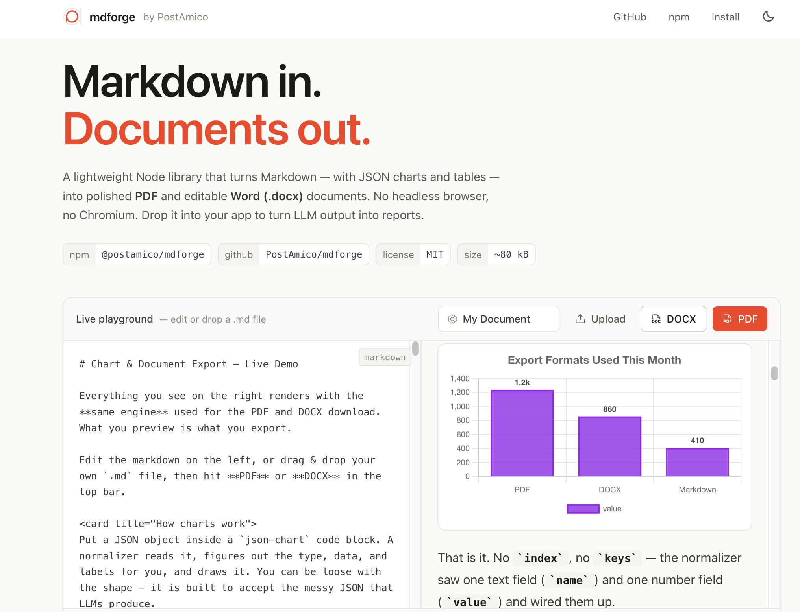
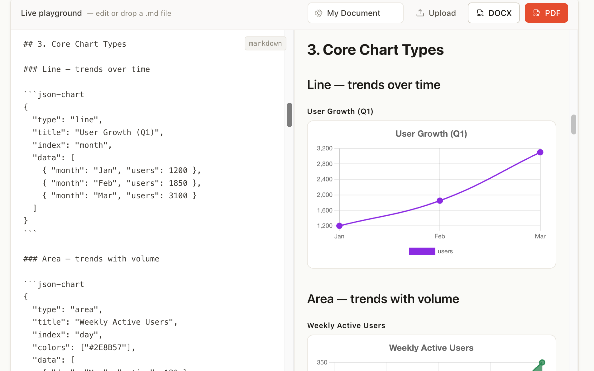

<div align="center">

# mdforge

**Forge markdown into polished PDF & DOCX. Pure Node, no headless browser.**

Turn markdown — with JSON charts and tables — into a clean, downloadable PDF or an editable Word document. No Chromium. No Puppeteer. Just Node.

[](https://www.npmjs.com/package/@postamico/mdforge)
[](./LICENSE)

<em>By <a href="https://github.com/PostAmico">PostAmico</a></em>

</div>

<!-- ─────────────────────────────────────────────────────────────────────── -->
<!-- SCREENSHOT / DEMO PLACEHOLDER                                            -->
<!-- Drop a screenshot of the live demo (editor + preview) here, and a GIF   -->
<!-- of a markdown → PDF/DOCX export. Suggested:                             -->

                                     
<!--                           -->
<!-- ─────────────────────────────────────────────────────────────────────── -->


---

## Why mdforge

Most markdown-to-PDF tools spin up a headless browser (Chromium via Puppeteer/Playwright) to render a page and print it to PDF. That works, but it's heavy: hundreds of megabytes, slow cold starts, and painful to run in serverless or CI.

mdforge takes a different path. It renders PDFs with [`pdfkit`](https://github.com/foliojs/pdfkit) and Word documents with [`docx`](https://github.com/dolanmiu/docx) — both pure JavaScript. The result is small, fast, and easy to embed anywhere Node runs, including AI apps that need to turn LLM output into structured reports.

- **No headless browser.** No Chromium, no Puppeteer, no Playwright.
- **Two outputs from one source.** Download an editable `.docx` to tweak in Word, or a ready-to-share `.pdf`.
- **Charts and tables.** Drop a JSON chart into your markdown and it renders as a crisp, high-resolution image in the document.
- **Lightweight.** ~80 KB tarball, ~309 KB unpacked, 3 runtime dependencies.
- **Clone it or install it.** Use it as an npm dependency, or fork the repo and drop it into your project.

---

## Use cases

mdforge fits anywhere you have text/markdown and need a real document out the other end, without shipping a browser.

- **AI & LLM reports** — turn a model's markdown answer (with charts and tables) into a downloadable PDF or editable Word doc. The forgiving chart normalizer is built for the loosely-shaped JSON LLMs emit.
- **App exports** — let users export dashboards, notes, wikis, or analytics as PDF/DOCX from your web or backend app.
- **Automated documents** — invoices, statements, receipts, contracts, and letters generated from templates on a schedule or per request.
- **Serverless & CI** — runs in AWS Lambda, Cloud Functions, Vercel, and CI runners where a headless browser is heavy, slow to cold-start, or simply won't install.
- **Email attachments** — generate a report `Buffer` and attach it directly to an outgoing email.
- **Editable handoffs** — deliver a `.docx` when the recipient needs to keep editing in Word, and a `.pdf` when it just needs to be read.

### Example: an LLM answer → downloadable report

```ts
import { markdownToPdf } from "@postamico/mdforge";

// `answer` is markdown produced by your model (it can include ```json-chart blocks)
const answer = await llm.generateReport(prompt);
const pdf = await markdownToPdf(answer, { title: "Weekly Summary", author: "Acme AI" });
// hand the Buffer to the user, email it, or upload it to storage
```

### Example: an Express / Node API route

```ts
import express from "express";
import { markdownToDocx } from "@postamico/mdforge";

const app = express();

app.post("/export/docx", express.json(), async (req, res) => {
  const { markdown, title } = req.body;
  const docx = await markdownToDocx(markdown, { title });
  res.setHeader(
    "Content-Type",
    "application/vnd.openxmlformats-officedocument.wordprocessingml.document",
  );
  res.setHeader("Content-Disposition", `attachment; filename="${title}.docx"`);
  res.send(docx);
});
```

### Example: a Next.js route handler

```ts
// app/api/export/route.ts
import { markdownToPdf } from "@postamico/mdforge";

export async function POST(req: Request) {
  const { markdown, title } = await req.json();
  const pdf = await markdownToPdf(markdown, { title });
  return new Response(new Uint8Array(pdf), {
    headers: {
      "Content-Type": "application/pdf",
      "Content-Disposition": `attachment; filename="${title}.pdf"`,
    },
  });
}
```

### Example: attach to an email (Nodemailer)

```ts
import { markdownToPdf } from "@postamico/mdforge";

const pdf = await markdownToPdf(markdown, { title: "Invoice 1042" });
await transporter.sendMail({
  to: customer.email,
  subject: "Your invoice",
  text: "Attached.",
  attachments: [{ filename: "invoice-1042.pdf", content: pdf }],
});
```

---

## Install

```bash
npm install @postamico/mdforge
```

That gives you full markdown → PDF/DOCX with tables and formatting.

### Charts are optional

Chart rendering uses [`canvas`](https://github.com/Automattic/node-canvas) (a native module) plus Chart.js. They are declared as **optional dependencies**, so:

```bash
# core only — text, tables, formatting, PDF & DOCX. No native build.
npm install @postamico/mdforge

# with charts — adds the optional native chart stack.
npm install @postamico/mdforge canvas chart.js
```

- **Without `canvas`:** everything works — text, tables, lists, links, formatting. Chart blocks are simply skipped (or throw a clear error if you pass `strictCharts: true`).
- **With `canvas` + `chart.js`:** chart blocks render into the document as high-resolution images, including value labels (percentages on pie/doughnut, values on bars) — no extra label plugin required.

Check availability at runtime with `isChartRenderingAvailable()`.

> Advanced chart types pull in a few more optional Chart.js packages (used automatically when installed). See the [chart support matrix](#chart-support-matrix).

---

## Quick start

```ts
import { writeFile } from "node:fs/promises";
import { markdownToPdf, markdownToDocx } from "@postamico/mdforge";

const markdown = `
# Q3 Marketing Report

Revenue grew **32%** quarter over quarter.

| Channel | Revenue | ROAS |
| ------- | ------: | ---: |
| Search  | $52,000 | 3.5x |
| Social  | $48,000 | 2.7x |

\`\`\`json-chart
{
  "type": "bar",
  "title": "Revenue by Channel",
  "data": [
    { "name": "Search", "value": 52000 },
    { "name": "Social", "value": 48000 }
  ]
}
\`\`\`
`;

const pdf = await markdownToPdf(markdown, { title: "Q3 Report" });
await writeFile("report.pdf", pdf);

const docx = await markdownToDocx(markdown, { title: "Q3 Report" });
await writeFile("report.docx", docx);
```

Both functions return a `Buffer`, so you can also stream it, attach it to an email, or return it from an API route.

---

## API

### `markdownToPdf(content, options?) → Promise<Buffer>`
### `markdownToDocx(content, options?) → Promise<Buffer>`

`content` is a markdown string. `options` is either a title string (shorthand) or an object:

| Option | Type | Default | Description |
| ------ | ---- | ------- | ----------- |
| `title` | `string` | `"Document"` | Document title (metadata + DOCX header). |
| `author` | `string` | — | Written to document metadata. |
| `strictCharts` | `boolean` | `false` | If `true`, throw `ChartRenderingUnavailableError` when a chart is present but `canvas` isn't installed. Default skips charts silently. |

```ts
// shorthand
await markdownToPdf(md, "My Report");

// full options
await markdownToDocx(md, { title: "My Report", author: "Jane Doe" });
```

### Chart helpers

```ts
import { isChartRenderingAvailable, renderChartToPng } from "@postamico/mdforge";

if (await isChartRenderingAvailable()) {
  const png = await renderChartToPng({ type: "pie", data: [{ name: "A", value: 1 }] });
  // png is a Buffer, or null if there was nothing to render
}
```

---

## Charts

Put a JSON object inside a fenced code block tagged `json-chart` (or `chart`). A built-in normalizer figures out the type, data, and labels for you — it's built to accept the loosely-shaped JSON that LLMs produce.

````md
```json-chart
{ "type": "line", "index": "month", "data": [
  { "month": "Jan", "users": 1200 },
  { "month": "Feb", "users": 1850 }
]}
```
````

### Chart schema

| Field | Required | Description |
| ----- | :------: | ----------- |
| `type` | yes | Chart type. Aliases work: `donut`, `column`, `spider`, `gantt`. |
| `data` | usually | Array of rows, e.g. `[{ "name": "A", "value": 5 }]`. |
| `title` | no | Heading drawn above the chart. |
| `index` | no | Field used for labels / x-axis. Inferred when omitted. |
| `keys` | no | Numeric series field(s). Inferred when omitted. |
| `colors` | no | Custom palette, e.g. `["#8A2BE2", "#4169E1"]`. |
| `stacked` | no | Stack series instead of grouping (bar/area). |

**Forgiving inputs.** Numbers may be written as `"$1,200"`, `"45%"`, or `"1.2M"` and still parse. Multiple numeric fields per row become multiple series automatically.

### Using the normalizer standalone

The chart normalizer is a pure, zero-dependency core you can use on its own — for example to feed a browser Chart.js instance:

```ts
import { normalizeChart, toChartJsConfig } from "@postamico/mdforge/chart-normalizer";

const { chart, ok, diagnostics } = normalizeChart(anyLlmJson);
const chartJsConfig = toChartJsConfig(chart);
```

### Chart support matrix

| Category | Types |
| -------- | ----- |
| Cartesian | `bar`, `line`, `area`, `radar`, `scatter`, `bubble` |
| Part-to-whole | `pie`, `doughnut`, `funnel`, `treemap` |
| Statistical | `histogram`, `box`, `distribution`, `interval` |
| Flow / relationship | `sankey`, `heatmap` |
| Business | `gauge`, `waterfall`, `timeline`, `quadrant`, `risk_matrix`, `break_even` |

Some advanced types need extra Chart.js plugins (installed automatically if present): `treemap` → `chartjs-chart-treemap`, `heatmap` → `chartjs-chart-matrix`, `sankey` → `chartjs-chart-sankey`, `box` → `@sgratzl/chartjs-chart-boxplot`.

---

## Custom content blocks

Beyond standard [GitHub Flavored Markdown](https://github.github.com/gfm/) (tables, task lists, code, blockquotes), mdforge understands a set of tag-based blocks (`<metrics_grid>`, `<workflow_timeline>`, `<lead_list>`, `<content_calendar>`, and more) that expand into structured tables in the output. See [`preprocessContent`](./src/lib/export/preprocess-content.ts).

---

## Try the demo

The repo includes a live Next.js playground — a split editor with a preview that renders exactly what you export.

```bash
git clone https://github.com/PostAmico/mdforge.git
cd mdforge
npm install
npm run demo:dev
```

---

## Known limitations

- `timeline` expects ISO-8601 dates; free-form strings like `"Q1 2024"` may not parse.
- `heatmap` alpha shading is tuned for 0–100 value ranges.
- Very wide tables (many columns) are laid out with equal column widths and may overflow.

Contributions welcome — see [CONTRIBUTING.md](./CONTRIBUTING.md).

---

## License

[MIT](./LICENSE) © Evotech Modern Solutions Pvt. Ltd
